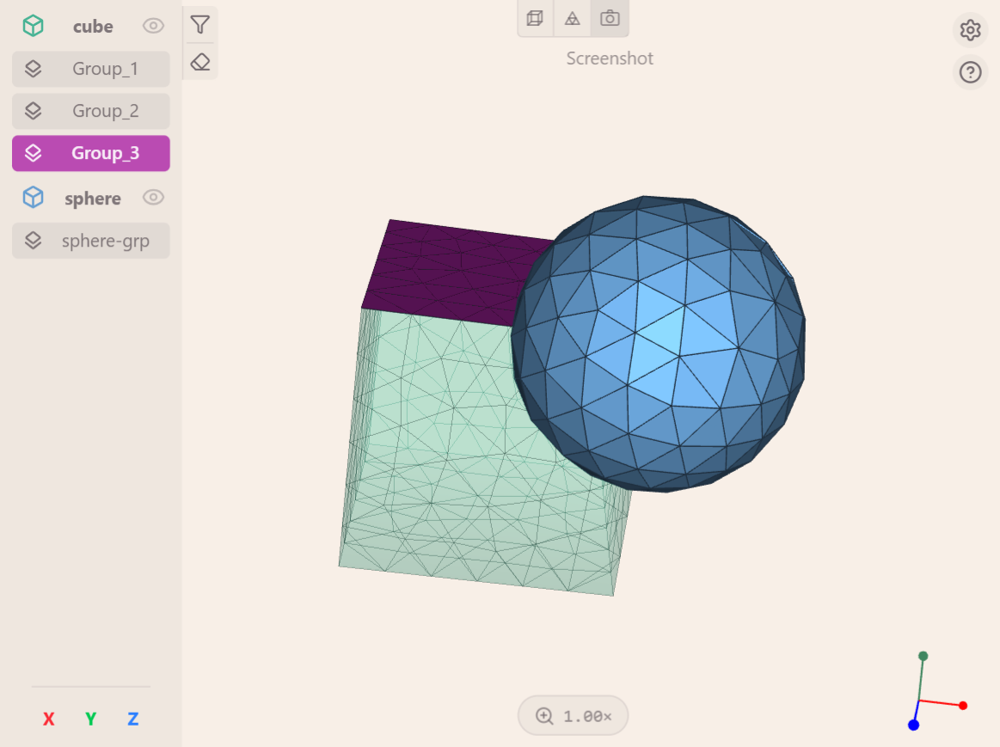

<p align="center"></p>

<p align="center">
  <a href="/"></a>
  <a href="./LICENSE"></a>
  <a href="https://github.com/simvia-tech/vs-code-aster/actions/workflows/ci.yml"></a>
  <a href="https://github.com/simvia-tech/vs-code-aster/issues"></a>
  <a href="https://marketplace.visualstudio.com/items?itemName=simvia.vs-code-aster"></a>
</p>

# VS Code Aster – VS Code Extension for code_aster

This is the first release of the **VS Code Aster** extension. The main objective is to collect feedback on any bugs or anomalies you encounter during its usage. All input regarding features is valuable, whether it's about how commands are triggered, unexpected behaviors, or options that could be added. Your experience and suggestions greatly help improve the extension.

## Description

**VS Code Aster** is a Visual Studio Code extension designed to simplify and speed up work with **code_aster**.
It offers:

- An interactive form to create or edit a `.export` file
- The ability to launch simulations directly from VS Code
- Advanced features for editing `.comm` files
- A fully integrated 3D Visualizer to explore your meshs

## Installation

### 1. Installing the extension

#### From the market place

The **VS Code Aster** extension is now available on the [VS Code Marketplace](https://marketplace.visualstudio.com/) :

1. Open VS Code then go to the Extensions tab (or press `Ctrl + Shift + X` / `Cmd + Shift + X`).
2. Search for `VS Code Aster`.
3. Click on **Install**.

#### From a .vsix file

- Download the .vsix file from the [latest release](https://github.com/simvia-tech/vs-code-aster/releases) :

  1. Choose your preferred version (latest is recommended)
  2. In the "Assets" section, click on the `vs-code-aster-[version].vsix` button.

> WSL users will need to copy the .vsix file to the WSL file system before continuing with the installation.
>
> ```
> cp /mnt/c/Users/[UserName]/Downloads/vs-code-aster-[version].vsix ~/
> ```

- Once you've got the `.vsix` file ready, you can open VS Code and :
  1. Open the Command Palette (`Ctrl + Shift + P` / `Cmd + Shift + P`).
  2. Search for and run `Extensions: Install from VSIX...`.
  3. Select the downloaded `.vsix` file.
  4. Reload your VS Code window — your extension is now installed !

### 2. Required dependencies

This extension requires **Python 3.8 or later** and the following packages :

- `numpy`
- `pygls==1.3.1`
- `medcoupling`

Here are **two ways** to install these packages :

#### 2.1. Use a dedicated Python virtual environment (recommended)

If you prefer to isolate your dependencies, or if pip cannot install system-wide packages, you can setup a virtual environment :

```bash
# Create a virtual environment
python3 -m venv ~/[env_name]

# Activate the venv
source ~/[env_name]/bin/activate

# Install required packages
pip install numpy pygls==1.3.1 medcoupling
```

Then point the extension to this environment :

1. Open `File > Preferences > Settings` (or press `Ctrl + ,` / `Cmd + ,`).
2. In the search bar, type `VS Code Aster`.
3. Locate `Python Executable Path`.
4. Set it to the absolute path of your environment’s Python executable, for example :

```
/home/[username]/[env_name]/bin/python
```

5. Reload the VS Code window (`Ctrl + R` / `Cmd + R`).

#### 2.2. Install directly with pip

If you'd rather install the Python packages globally :

```bash
pip install numpy pygls==1.3.1 medcoupling
```

### 3. (Optional) Installing Cave

If you'd like to run simulations, you need to have **cave** installed on your system. You can follow the instructions on [the cave GitHub repository](https://github.com/simvia-tech/cave).

You're now ready to use **VS Code Aster** !

## Features overview

### 1. Creating and managing .export files

The extension provides a native-looking Svelte form to create and edit `.export` files, plus first-class language support (syntax highlighting and a document formatter).

#### Opening the form

- **New file** — open the Command Palette (`Ctrl + Shift + P` / `Cmd + Shift + P`) and run `Edit export file`. The tab title defaults to `untitled` and the form is pre-filled with a standard starter: a `comm` + `mmed` input and an `rmed` output (`simvia.comm`, `simvia.mmed`, `simvia.rmed`).
- **Existing file** — open a `.export` file and click the blue pencil `Edit export file` in the editor title bar. The form is pre-filled from the file and the Save button replaces Create.

#### Form behavior

- The file name field lives-updates the tab title; the `.export` extension is shown as a non-editable suffix. Path separators are supported (`subdir/run.export` creates `subdir/` if it doesn't exist).
- The file type dropdown is filtered by direction: inputs accept `comm, mmed, nom, base, mail, libr, msh, dat`; outputs accept `mmed, rmed, mess, base, mail, tab, msh, dat`. `nom` rows are locked to unit 0 (can be repeated).
- Units auto-increment within the same type family (`med: 20, 50` → next `med` lands at `51`), ArrowUp / ArrowDown on any integer input steps the value.
- Rows can be **dragged to reorder** (drag handle at the left) and deleted individually with the × button. Empty rows are ignored on save.
- Inline validation shows per-field error messages; a sticky footer reports error and warning counts with click-to-scroll links:
  - **Blocking** errors: missing filename, non-integer parameters, no `comm` input (code_aster needs one).
  - **Warnings**: duplicate units across files, no mesh (`mmed`/`mail`/`msh`) set, no `rmed` output set, rename preview (shows the old file will be deleted).
- The panel is tab-switch safe: the in-progress form is preserved via webview state, so you can glance at another file and come back without losing your changes.

#### Syntax highlighting and formatting

- `.export` files now have their own TextMate grammar: `P`/`F` directives, parameter names, file types, `D` vs `R`/`RC` direction flags, unit numbers and `#` comments each get their own theme scope.
- `Format Document` (Shift+Alt+F) reorders the file into three commented sections — `# Simulation parameters`, `# Input files`, `# Output files` — sorts F lines by a canonical type priority, and keeps standalone `#` comments attached to the line they precede.
- Saving/creating from the form runs the same formatter automatically, so files stay tidy across repeated edits.

### 2. Launching a simulation

> You need to have **cave** installed on your system to launch simulations. Refer to [the cave GitHub repository](https://github.com/simvia-tech/cave) if you want to install **cave**.

**From a .export file**

1. Open a `.export` file.
2. Click on the "play" icon `Run with code_aster` in the top-right corner of the file.

It will open a terminal and execute the following command : `cave run [file].export`. Subsequent runs reuse the same terminal.

**Diagnostics**

Warnings (`<A>`), errors (`<E>`, `<F>`), Python tracebacks, and fatal errors from code_aster automatically appear in the VS Code **Problems panel** after a run — no `F mess` entry required in the `.export` file. Diagnostics are attached to the originating `.comm` line when possible and cleared between runs.

**Personnalize alias to run code-aster**

If you want to use a custom alias, you can :

1. Open VS Code.
2. Go to `File > Preferences > Settings` (or press `Ctrl + ,` / `Cmd + ,`).
3. In the search bar, type `VS Code Aster`.
4. Find the setting `Alias For Run` and change the value to the command you want to use to run **code_aster**.

### 3. Smart editing of .comm files

**Syntax highlighting**

- Dedicated highlighting for **code_aster** syntax, making `.comm` files more readable
- For the best experience, use a theme that differentiates functions, variables, etc.

**Hover documentation**

- When hovering over a **code_aster** command, a tooltip displays :
  - The command description
  - The command arguments
  - The types and default values of arguments

**Command signatures**

- When typing a `(` after a command name, or a `,` after entering an argument (e.g., `FORMAT="MED",`), a signature is displayed
- This signature shows the parameters (depending on context — some parameters are only available under certain conditions)

**Contextual auto-completion**

- The extension automatically suggests :
  - Command names
  - Relevant arguments depending on the current command

**Status Bar**

- A status bar is displayed at the bottom of the window, showing the number of steps completed in the current command file, e.g., `code_aster: 3/5 steps`.
- Clicking on the status bar opens a detailed view of completed commands for each family.

### 4. The visualizer — Interactive 3D result viewer

The visualizer is an integrated 3D viewer that lets you display and explore your simulation geometry and results directly in VS Code — without leaving your workspace.

It’s powered by **VTK.js**, and surfaces every named group from your `.med` mesh: volume groups (rendered as the skin of each 3D sub-domain), face groups, edge groups (1D line elements), and node groups.



#### Opening the visualizer

There are two ways to open the visualizer :

- **From a `.comm` file** : click on the "eye" icon `Open visualizer` in the top-right corner of the file.
- **From a `.med` file** : click any `.med`, `.mmed`, or `.rmed` file in the explorer — it opens directly in the viewer, no `.comm` file needed. Files with non-standard MED extensions (e.g. `.71`) are auto-detected and can be registered in one click.

#### Features

- Load geometry files (`.med`) directly into the viewer
- Highlight volume, face, edge, and node groups using the sidebar — each kind gets its own icon
- Highlight groups quickly by selecting their names from your command file (`.comm`)
- Control the camera by rotating or panning it
- **Bounding box** : toggle a wireframe cube with colored axes (X red, Y green, Z blue), corner dots, and dimension labels to quickly read the characteristic size of the structure
- **Wireframe mode** : switch between solid surface and wireframe rendering to inspect mesh density
- **Auto-rotate** : hands-free turntable that spins the camera around the current view-up; right-click the button to reveal a popover with a speed slider (5–180 °/s) and a reverse-direction toggle — changes there apply to the current view only, persistent defaults live in _Settings → Toolbar_
- **Screenshot** : save the current 3D view as a PNG file next to your mesh and copy it to the clipboard; right-click for a menu to capture the whole webview (toolbar + sidebar baked in)
- **Record** : capture a video of the view (mp4 when the runtime supports h264, webm otherwise), saved to `.vs-code-aster/recordings/`; left-click to start/stop, right-click for whole-webview or without-sidebar variants. The button pulses red with an elapsed-time indicator while recording
- **Per-kind settings** : Settings popup exposes edge-group line thickness, edge-group depth offset (to avoid z-fighting), node-group point size, and the sidebar sort order — plus a toggle to bucket groups by kind or mix them into a single list
- **Remembered toolbar defaults** : every toolbar button (bounding box, wireframe, auto-rotate) is session-only by default — toggling it changes the current view only. Persistent defaults are set in _Settings → Toolbar_, grouped per feature (Bounding box, Wireframe, Auto-rotate with default speed and default direction)
- **Dream background** : on by default, animates EDF orange and blue light blobs behind the mesh for a more vibrant workspace; can be disabled from _Settings → Rendering_

#### Usage tips

- Group highlighting :
  - Click on a group name in the sidebar to highlight or unhighlight it
  - Click on the "clear" button in the sidebar to reset highlight status for all groups
  - Click on the "filter" button in the sidebar to choose which groups are easily accessible in the sidebar
  - Objects becomes transparent when you highlight their groups, helping visualize details more clearly
- Camera control :
  - Hold `Left click` and move your mouse to rotate the camera
  - Hold `Ctrl` + `Left click` and move your mouse to rotate the camera around an axis
  - Hold `Shift` + `Left click` and move your mouse to pan the camera
  - Use the `Mouse wheel` to zoom in and out
  - Click on the `X`, `Y`, and `Z` buttons at the bottom of the sidebar to quickly align the camera along an axis
- Toolbar :
  - The top toolbar provides quick access to the bounding box, wireframe, auto-rotate, screenshot, and record features
  - Left-click toggles a feature for the current view only; remembered defaults live in _Settings → Toolbar_
  - Right-click the **auto-rotate** button for a session-only speed slider and reverse-direction toggle
  - Right-click the **screenshot** button for a menu to capture the whole webview (sidebar included)
  - Right-click the **record** button for options: whole webview, or without the sidebar
- Settings tabs : _Rendering_ (mesh-edge mode, orientation widget, dream background), _Groups_ (per-kind display), _Visibility_ (ghosted objects, highlight transparency), _Toolbar_ (default state for toolbar buttons)
- File management :
  - Files generated by the extension are stored in a hidden `.vs-code-aster/` folder next to your project files:
    - `mesh_cache/` — converted `.obj` files from your `.*med` meshes, reused on subsequent opens
    - `screenshots/` — PNGs saved from the viewer's screenshot button
    - `recordings/` — video files saved from the viewer's record button (mp4 / webm)
    - `run_logs/` — one timestamped log per code_aster run (oldest pruned, see `vs-code-aster.maxRunLogs`)

## Troubleshooting

If you encounter an error that seems to have broken the language server (for `.comm` files), you can restart it without closing VS Code:

1. Open the Command Palette (`Ctrl + Shift + P` / `Cmd + Shift + P`).
2. Type `Restart the LSP Server for code_aster` and select it.
3. The language server will restart, restoring hover, signature help, completion, and other language features !

## Development

> You need to follow the installation steps before proceeding with this section.

### 1. Prerequisites

You need to have Node.js 20 or later and npm installed on your system :

```bash
curl -fsSL https://deb.nodesource.com/setup_20.x | sudo -E bash -
sudo apt install -y nodejs

# Check installation
node -v
npm -v
```

### 2. Installing dependencies

1. Clone the repository :

```bash
git clone https://github.com/simvia-tech/vs-code-aster.git
```

2. Install packages :

```bash
npm install
```

### 3. Architecture overview

The extension consists of three independently compiled parts :

- **Extension host** (`src/`) — TypeScript compiled with esbuild, runs in Node.js inside VS Code
- **Viewer webview** (`webviews/viewer/`) — Svelte 5 + Vite app that powers the 3D visualizer; built separately into `webviews/viewer/dist/`
- **Export form webview** (`webviews/export/`) — Svelte 5 + Vite app that powers the `.export` file editor; built separately into `webviews/export/dist/`

### 4. Running the extension locally

Press `F5` (or go to `Run > Start Debugging`) to launch a new VS Code window running the extension.

This starts three background watch tasks automatically (defined in `.vscode/tasks.json`) :

| Task | What it does |
|---|---|
| `npm: watch:esbuild` | Recompiles the extension host on every save |
| `npm: watch:tsc` | Type-checks the extension host continuously |
| `npm: watch:webview` | Rebuilds both Svelte webviews (viewer + export form) on every save |

After making changes to the **extension host** (`src/`), reload the debug window with `Ctrl + R`.

After making changes to a **webview** (`webviews/viewer/src/` or `webviews/export/src/`), wait for the `watch:webview` task to finish rebuilding, then run `Developer: Reload Webviews` from the Command Palette.

### 5. Building manually

To build everything from scratch without starting the debug session :

```bash
# Build the webview
npm run build:webview

# Compile and type-check the extension host
npm run compile
```

## Telemetry

**VS Code Aster** includes optional telemetry features to help improve the tool by collecting anonymous usage data.

By default, usage tracking is enabled, sending anonymous data about which features you use. You can disable this tracking if you prefer.

To deactivate telemetry :

1. Open VS Code Settings (`File > Preferences > Settings` or `Ctrl + ,` / `Cmd + ,`)
2. Search for `VS Code Aster` in the settings search bar
3. Find the setting `Enable Telemetry` and uncheck it

Telemetry respects your privacy and does not collect sensitive information.

## Contributing

Please check out our [CONTRIBUTING.md](./CONTRIBUTING.md) file if you want to contribute to the project.

Thank you to all our contributors :

- Hadrien Riols - [Email](mailto:hadrien.riols@gmail.com)
- Basile Marchand - [Email](mailto:basile.marchand@simvia.tech)
- Ulysse Bouchet - [Email](mailto:ulysse.bouchet@simvia.tech) - [Website](https://ulyssebouchet.fr)

## See Also

- [Cave's GitHub repository](https://github.com/simvia-tech/cave)
- [Simvia's website](https://simvia.tech)

## License

This project is licensed under the GNU General Public License version 3 (GPL-3.0).
See the full license text in the [LICENSE](./LICENSE) file.

- **Summary:** You are free to use, copy, modify, and redistribute this software.
- **Conditions:** Redistributions and derivative works must be licensed under GPL-3.0 and include source or a written offer to provide the source.
- **More information:** https://www.gnu.org/licenses/gpl-3.0.en.html

## Contact Us

Contact us at [ulysse.bouchet@simvia.tech](mailto:ulysse.bouchet@simvia.tech) or [basile.marchand@simvia.tech](mailto:basile.marchand@simvia.tech).
